<div align="center">



<br><br>


<br>

[](https://www.linkedin.com/in/rodrigo-monteiro-toffoli-teixeira-a99b99278/)
&nbsp;
[](mailto:rodrigomt.teixeira@gmail.com)
&nbsp;
[](https://www.instagram.com/rod.mtt/)

</div>

<br>

<table border="0">
<tr>
<td width="55%" valign="top">

```python
class Rodrigo:
    edu    = "Ciência da Computação @ Mauá"
    path   = "backend  →  engenharia de IA"
    focus  = [
        "harness e agentes generativos",
        "visão computacional na borda",
        "do modelo ao produto",
    ]
    langs  = ["Python", "Java", "JavaScript", "R", "SQL"]
    now    = "CityRain — chuva urbana com edge + CV"
```

</td>
<td width="45%" valign="top" align="center">


</td>
</tr>
</table>

<br>

## ⚡ IA na prática

**🤖 Agentes generativos** — arquiteturas multi-agente em produção: orquestração, tool use, RAG e integração com sistemas legados. Agentes que recebem uma transcrição e devolvem um artefato pronto.

**🧰 Harness** — a engenharia em volta do modelo: definição de ferramentas, contexto e memória, guardrails, loops de execução e avaliação. É o que separa um agente que funciona na demo de um que funciona toda vez.

**👁️ Visão na borda** — CNNs leves (MobileNet, EfficientNet) em Jetson com inferência particionada: filtro rápido no dispositivo, decisão fina no backend.

**🧪 Pipeline completo** — coleta em campo, dedup e split protegido, treino, avaliação contra ground truth e serviço via API.

**🎓 Capacitação** — treino times técnicos e de negócio no uso de LLMs, agentes e automação no dia a dia.

<br>

## 🌧️ CityRain

> Monitoramento de chuva urbana com **edge computing + visão computacional** · TCC

Nós de borda com câmera classificam a intensidade da chuva em tempo real. Um classificador binário roda na **Jetson Nano**; o modelo de 4 classes roda no backend com agregação espacial **H3**, validado contra **CGE-SP, INMET e CEMADEN**.

`Jetson Nano` `PyTorch` `OpenCV` `FastAPI` `PostgreSQL` `H3`

<br>

## 🛠️ Stack

<div align="center">


</div>

<br>

<div align="center">


<br><br>

<sub>Modelo que não roda em produção é slide.</sub>

</div>
